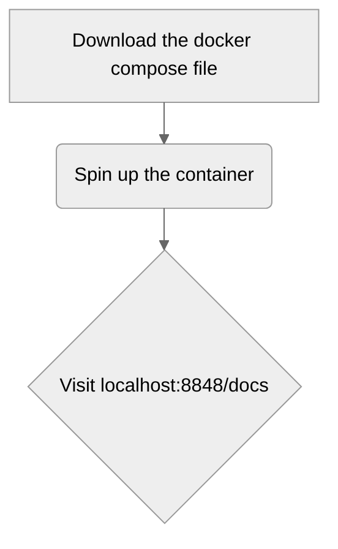
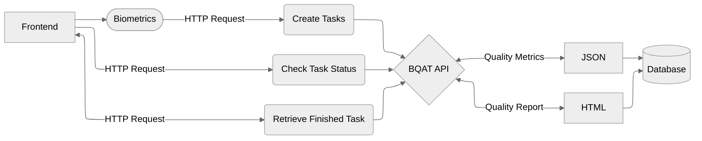
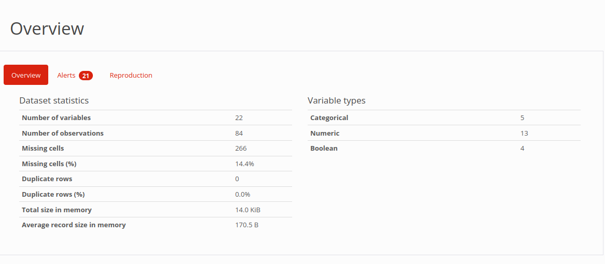
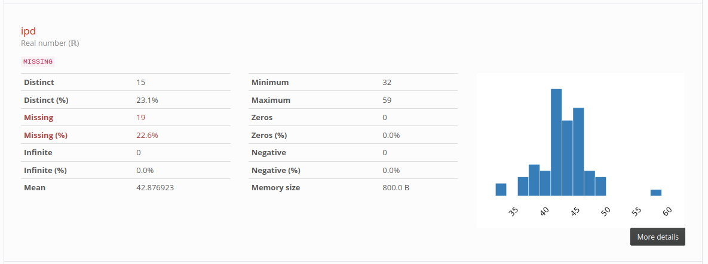
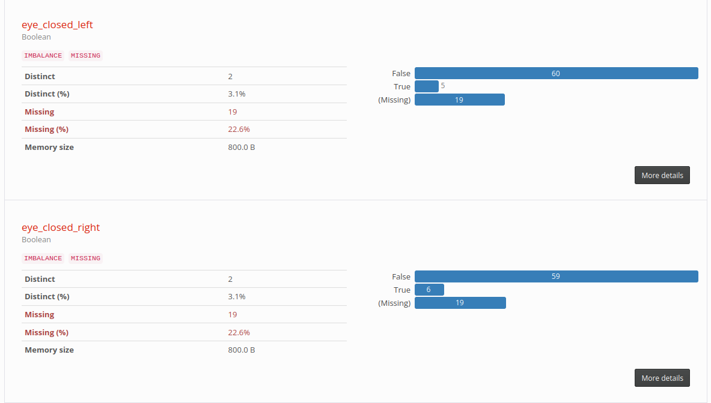
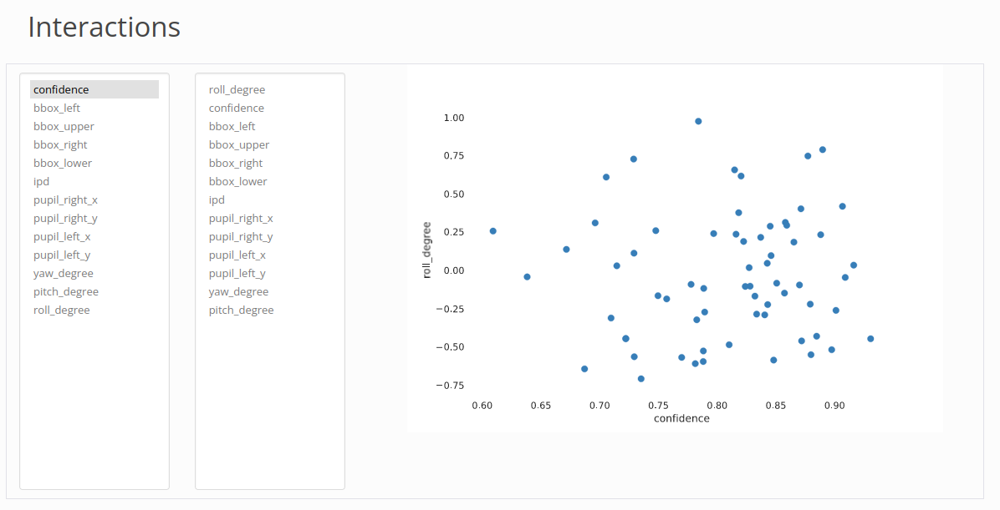
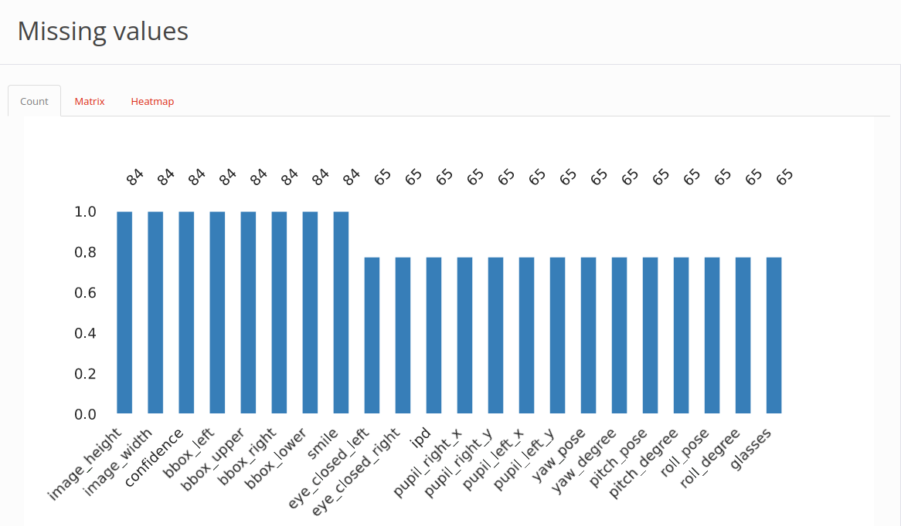

<details open markdown="block">
  <summary>
    Table of contents
  </summary>
  {: .text-delta }
- TOC
{:toc}
</details>

---


## Setting Up



## Integration

BQAT API is designed to be a self-contained backend service for biometrics analysis. It could be considered the endpoint from the front-end product. 

> The codebase in this repository does not include proper configuration for production environment, so you may want to set up your proxy server, domain, web server workers, etc. 

## Workflow



---

1. Create a scan task with your input dataset (__POST /scan/__), the dataset could come from local `data/` folder or upload via the HTTP request.
2. Note down the task ID (`tid`) from the response, and check the status of this task (__GET /task/{task id}/__).
3. Retrieve the results using dataset ID (`collection` ID from response above) from the server (__GET /scan/{dataset id}/profiles__).

## Endpoints

---

<!-- ### POST /scan/

Create scan task from images in `data/` folder mounted to the container.

--- -->

### POST /scan/uploaded

Create scan task from images uploaded via the endpoint. 

---

### GET /task/{task_id}/

Check task status.

---

### GET /scan/{dataset_id}/profiles

Create scan task from images uploaded via the endpoint. 

---

### GET /scan/{dataset_id}/outliers

Try to detect outliers of this dataset (task).

---

### GET /scan/{dataset_id}/report

Get assesment report of this dataset (task).

---

> Note: Refer to `localhost:8848/docs` for full list of endpoints.

## Response

JSON:

``` JSON
{
  "file": "12347.jpg",
  "image_height": 244,
  "image_width": 212,
  "confidence": 0.866117537021637,
  "bbox_left": 49,
  "bbox_upper": 74,
  "bbox_right": 183,
  "bbox_lower": 208,
  "smile": false,
  "eye_closed_left": false,
  "eye_closed_right": false,
  "ipd": 48,
  "pupil_right_x": 43,
  "pupil_right_y": 45,
  "pupil_left_x": 91,
  "pupil_left_y": 47,
  "yaw_pose": "Right",
  "yaw_degree": -24.930552093832574,
  "pitch_pose": "Down",
  "pitch_degree": -32.260817406476285,
  "roll_pose": "Level",
  "roll_degree": -0.4556886155332786,
  "glasses": true
}
```

---

Quality Report:



---



---



---



---



---

---
