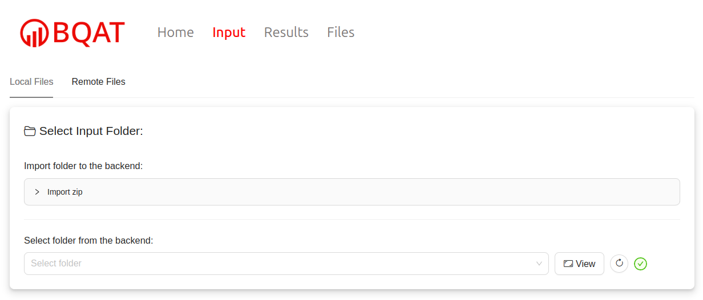
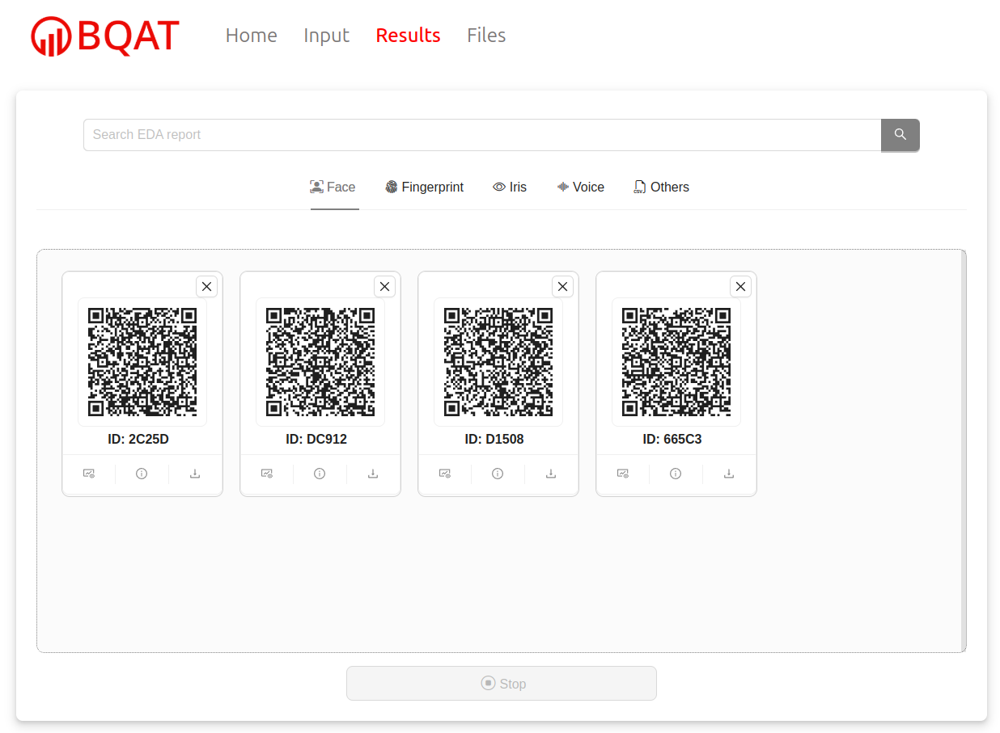

  

    Table of contents
  

  {: .text-delta }
- TOC
{:toc}

---

## Setting Up

## Workflow

> BQAT-GUI could also distrubuted as a desktop application, reach out to us for further detail.

## User Interface

### Home

This is the landing page, with a brief introduction to the BQAT workflow.

### Data Input

Import/select input data and submit analysis task.

1. Local files

   - The user could import dataset as zip file to the server.

   - Or may transfer the data to the data folder on the machine (if you run it on your local machine or have access to the machine).

2. Remote files

   - The user could also upload files from the browser directely (limited number possible), and the data won't be saved on the server once processed.

---

You may filter the input files by filename or type.

---

You may convert/rescale the input files if needed.

---

Select dataset modality and processing engine(s).

### Task Management

Monitor status of ongoing task. You can stop/resume or cancel the task.

---

Preview/download output data.

---

Identify potential outliers using output data.

---

Generate EDA report using output data.

### Analysis Results

You may view/download the EDA report in this page. You can also share the report via the QR code.

### Data Management

Instead of import/upload the dataset from input tab, you may upload the dataset via this tab beforehand (and delete if you like). 

---

You can inspect the data as well (WSQ fingerprint files supported).

---

## Output

### Raw Data

---

### EDA Report

---

### Outlier Detection

# BQAT-GUI lite

This version is a simple example web interface, which expose only the main biometic processing function.

> Note: Not suitable for large dataset processing due to browser limitation.

## Setting Up

---

## Workflow

## User Interface

---

## Output

The output can be downloaded as CSV.

