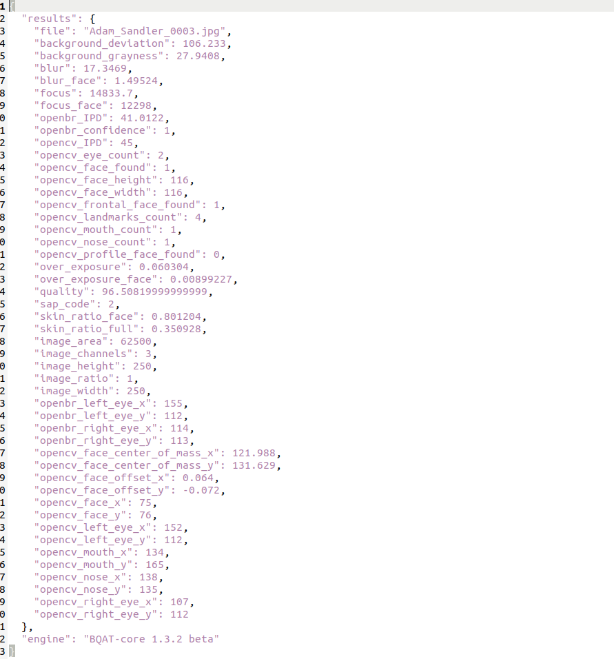

<details open markdown="block">
  <summary>
    Table of contents
  </summary>
  {: .text-delta }
- TOC
{:toc}
</details>

---
## Setting Up


---

## Workflow


---

## Endpoints

---

### POST /file

Upload a biometric file for quality assessment:

#### Query Parameters:
- **modality**: specify modality of the biometric (face, fingerprint, iris, speech).
- **engine**: specify processing engine for the biometric sample (bqat, ofiq, biqt).

#### Body Parameters (data):
- **file**: biometric file.

---

### POST /base64

Upload a biometric file (base64) for quality assessment:

#### Query Parameters:
- **urlsafe**: (bool) urlsafe encoded or not.

#### Body Parameters (JSON):
``` json
{
    "modality": "face",
    "engine": "ofiq",
    "type": "jpg",
    "data": "<base64 string>",
    "id": "123e4567-e89b-12d3-a456-426655440000",
}
```
- **modality**: specify modality of the biometric (face, fingerprint, iris, speech).
- **engine**: specify processing engine for the biometric sample (bqat, ofiq, biqt).
- **type**: biometric file type (png, jpg, wav, jp2, etc.).
- **data**: biometric file encoded as base64 string.
- **id**: biometric file identifier.
- **timestamp**: ISO 8601 date and time format.

---

> Note: Refer to `localhost:8848/docs` for full list of endpoints.

<!-- 

## Response

 -->

## Response

JSON:

``` JSON
{
  "file": "12347.jpg",
  "image_height": 244,
  "image_width": 212,
  "confidence": 0.866117537021637,
  "bbox_left": 49,
  "bbox_upper": 74,
  "bbox_right": 183,
  "bbox_lower": 208,
  "smile": false,
  "eye_closed_left": false,
  "eye_closed_right": false,
  "ipd": 48,
  "pupil_right_x": 43,
  "pupil_right_y": 45,
  "pupil_left_x": 91,
  "pupil_left_y": 47,
  "yaw_pose": "Right",
  "yaw_degree": -24.930552093832574,
  "pitch_pose": "Down",
  "pitch_degree": -32.260817406476285,
  "roll_pose": "Level",
  "roll_degree": -0.4556886155332786,
  "glasses": true
}
```

## Benchmark

Test environment: 6 core/12 threads, 16 GB, LAN, 10 users

| Test Cases  | RPS         | AVG Latency |
| ----------- | ----------- | ----------- |
| Face (BQAT) | 32.8        | 370ms       |
| Face (OFIQ) | 0.4         | 6000ms      |
| Face (BIQT) | 5.5         | 1700ms      |
| Iris        | 23.6        | 800ms       |
| Fingerprint | 10.2        | 1100ms      |

> OFIQ is tested with 3 users rather than 10, that is the maximum possible for this environment. For the others, 10 might not be the upper limit.

## Stability

Due to the nature of OFIQ engine, each time it was called, there is a initialisation process which will take significant time to load the underlying models (4~7s), whereas the actual processing time of the image take 300~500ms. As a result, if you send the image one by one, the response time will be 4~7s per image. And because of this, it is difficult to achieve parallel processing due to excessive memory usage per request. This the reason for the 3 users limit in our test above, otherwise the container might crash due to OOM error.

You can configre number of service workers via env variable `WORKERS` in the compose file:

``` yaml
server:
    image: ghcr.io/biometix/bqat-stateless:latest
    shm_size: 8gb
    # environment:
    #   - WORKERS=3
    ports:
      - 8848:8848
```

By default, the number of workers is configured to be the number of the cores/threads of your CPU (80%~100% utilisation). You may increase the number to squeeze more performance out of the CPU or decrease it to make the system more stable.

If you like to further increase the system throughput, you may either scale up by deploy to a container cluster with load balancer, or switch to [BQAT-API](https://biometix.github.io/cookbook/api.html) for bulk processing.

## Scalability

Due to BQAT's compute-intensive nature, the server’s throughput is primarily limited by the CPU and RAM of the host machine, including factors such as the number of cores, single-core performance, and RAM.​
    
Scaling options:​

+ Vertical: deploy to a machine with larger CPU.​

+ Horizontal: deploy to a cluster of machines (e.g. Kubernetes, Docker Swarm, etc.)

### Example (Docker Swarm):

> This is for local small scale deployment, use Kubernetes for large scale production environment.

> This example is tested on Linux nodes only, further configuration might be needed for Windows and macOS.

#### Prepare worker nodes

+ Make sure you have all your worker machines/VMs installed with [Docker Engine](https://docs.docker.com/engine/);

+ Take note of their IP addresses.

#### Set up cluster

Select one machine as the manager, then open the terminal on this manager computer:

``` sh
docker swarm init --advertise-addr <MANAGER-IP>
```

Use the command printed from previous step to add worker nodes (looks like this). Run this command on all the worker nodes:

``` sh
docker swarm join --token kz5s954yi3oex3nedyz0fb0xx1 192.168.101.101:8008
```

After all your worker nodes joined, check if your cluster was set up properly:

``` sh
docker node ls
```

#### Deploy to cluster

Deploy BQAT-Stateless to the cluster:

``` sh
docker stack deploy --compose-file compose.yaml bqat-stateless
```

Check service status

``` sh
docker stack services bqat-stateless
```

Scale up the service using the worker nodes (4 replicas in this example):

``` sh
docker service scale bqat-stateless_server=4
```

> Congratulations! The cluster has been set up! 🎉 You can now make requests to the endpoints as you typically would! The loads will be distributed across the worker nodes.

> Note: bring up more replicas than number of the physical machines might not further increase the throughput.

#### Clean up

Bring down the service:

``` sh
docker stack rm bqat-stateless
```

Disconnect worker node (on the worker machine):

``` sh
docker swarm leave
```

Remove the node from the cluster (on manager machine):

``` sh
docker node rm <NODE-ID>
```

> Please refers to Docker [official documentation](https://docs.docker.com/engine/swarm/) for further details.