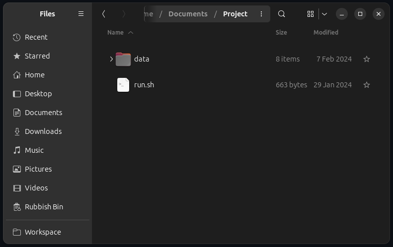

# BQAT CLI

---
<details open markdown="block">
  <summary>
    Table of contents
  </summary>
  {: .text-delta }
- TOC
{:toc}
</details>

---

{: .important }
> New version of `run.sh` is published, please download the [latest](https://raw.githubusercontent.com/Biometix/bqat-cli/main/run.sh) and replace the old one.

<a name="setup">
## Setup

This tool is designed to be run as a Docker container via command line interface (terminal). For ease of use, a convenience script is provided. 

### Download the script
{: .no_toc }

#### Linux

[Bash](https://raw.githubusercontent.com/Biometix/bqat-cli/main/run.sh){: .btn }

#### Windows

[Powershell](https://raw.githubusercontent.com/Biometix/bqat-cli/main/run.ps1){: .btn }

<a name="usage">
## Usage

+ Download the script above into your working directory.
+ Create a folder named `data` under your working directory and put your input files in this folder.

After the aforementioned steps, you should have a folder like this:



``` sh
# Grant execution permission to the script (for Linux shell script)
sudo chmod +x run.sh
```

+ Open your CLI and navigate to this directory.
+ Enter the command below to run BQAT.

For Bash (Linux, macOS, Windows):

``` sh
# Process all face images in data/ folder
./run.sh --input data/ --mode face

# Process iris images in data/iris/ folder
./run.sh --input data/iris/ --mode iris
```

> Note: The path format of the mounted volumes in the run.sh may need modification for the specific shell (e.g. under Windows. Or you can use the powershell script as follows). 

For PowerShell (Winodws, Linux):

``` ps
# Process all face images in data/ folder
.\run.ps1 --input data/ --mode face

# Process iris images in data/iris/ folder
.\run.ps1 --input data/iris/ --mode iris
```

Get BQAT-CLI Update if available:

``` sh
# Linux
./run.sh --update
```

``` ps
# Windows
.\run.ps1 --update
```

<a name="output">
## Output

The outputs will be saved at: `data/output/`.

## Further details about the command and other option flags
{: .no_toc }
+ [Command Line Interface Playbook](https://biometix.github.io/playbook/cli.html)

> Note: The tool is designed to be executed with a `/data` folder in your working directory. The `/data` folder (where all the images are stored) will be mounted to the container. "Read and write” permission is required for this folder. It should work as long as the folder was created before spinning up the server. Otherwise, the ownership of the folder will need to be changed. 