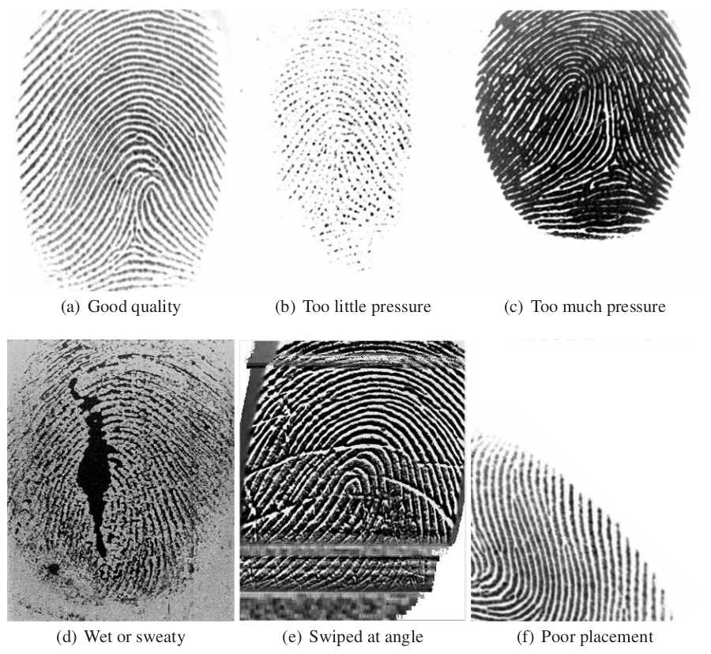
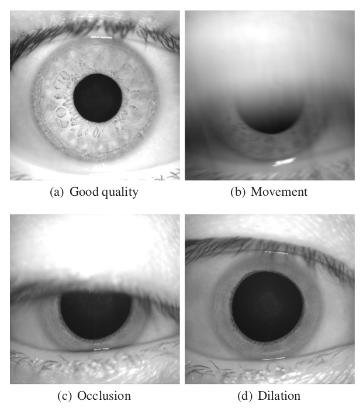
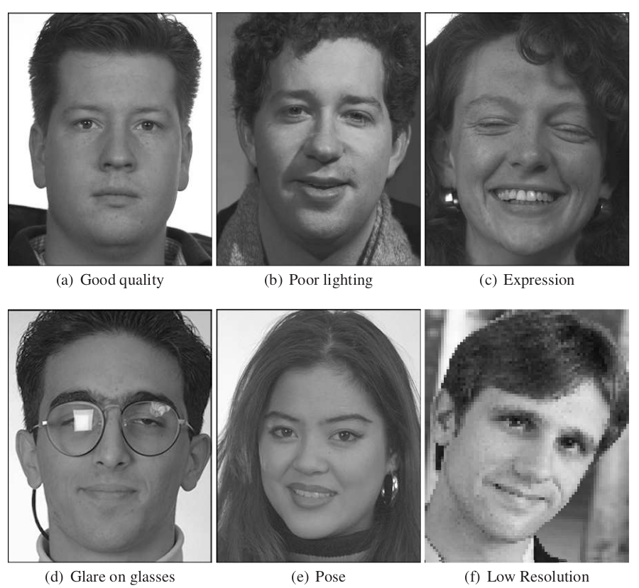

# __Biometric Quality Assessment Tool (BQAT)__

## Overview

BQAT is a biometric quality assessment tool for generating and analysing given biometric samples’ quality to international standards as well as to customized metrics. The BQAT tool functions by taking an input directory of biometric data and will produce both the raw quality information as well as an analysis report.

The quality of biometric samples is a key aspect of the performance and usefulness of a biometric systems. Whilst there are a variety of tools per modality, this project is aimed to provide an open source framework to support all common modalities and allow for expansion as new methods are developed.

## Modality

+ __Fingerprint__

    The analysis of fingerprint engine based on NIST/NFIQ2 quality features. The quality score links image quality of optical and ink 500 PPI fingerprints to operational recognition performance.

+ __Face__

    The face image assessment module provides metrics includes head pose, smile detection, inter-eye-distance, closed eyes, etc.

+ __Iris__

    The iris sample assessment module provides various quality attributes, features, and ISO metrics.

+ __Speech__

    The speech assessment module provides various quality metrics, including naturalness, coloration, noisiness, etc.

### Examples of biometric data quality variation

#### _Fingerprint_

#### _Iris_

#### _Face_

### Key features of the project

+ A variety of different methods of access including via CLI, GUI and as a server
+ Simple installation via docker
+ Outlier identification
+ Built by an experienced (>15 years) biometric consulting team
+ An active open source community

### Supporting libraries include

+ [NFIQ2](https://github.com/usnistgov/NFIQ2)
+ [BIQT](https://github.com/mitre/biqt)
+ [MediaPipe](https://github.com/google/mediapipe)
+ [NISQA](https://github.com/gabrielmittag/NISQA)

## Variation of the Toolbox

BQAT is available in multiple form factors:

+ __[CLI](https://github.com/Biometix/bqat-cli)__

    
    
    
    
    

    BQAT in the terminal. A CLI tool for biometrics.

+ __[API](https://github.com/Biometix/bqat-api)__

    
    
    
    
    
    

    BQAT via RESTful API. A self-contained server solution.

+ __[Stateless](https://github.com/Biometix/bqat-stateless)__

    
    
    
    
    

    Stateless version of BQAT API. No data will be stored on the server, similar to a serverless function.

+ __GUI__

    
    
    
    
    

    Simple Web GUI for BQAT API. A easy to use user interface to the services.

---

{: .highlight }
> Please contact us at info@biometix.com if you'd like more information.
