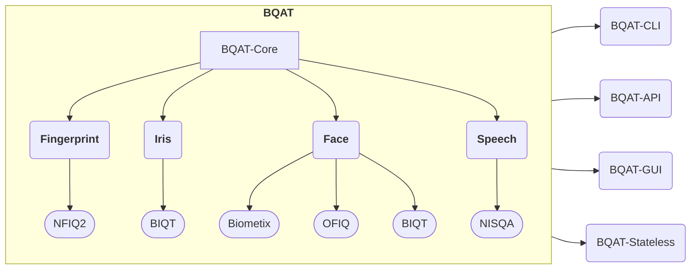

{: .highlight }
> Introducing the new [OFIQ](https://pages.nist.gov/ifpc/2022/presentations/2_IFPC2022_OFIQ_Overview_Stratmann.pdf) face processing engine! [Try it now](https://biometix.github.io/playbook/cli.html#alt-engine)!

{: .highlight }
>  Join and share your ideas at [Discussions](https://github.com/Biometix/bqat-cli/discussions/1)!

---


<!-- # __Biometric Quality Assessment Tool (BQAT)__ -->

<!-- ``` mermaid
mindmap
  root((**BQAT**))
    BQAT-CLI
      EDA Report
      CSV
    BQAT-API
      Cloud
      Self-Hosted
    BQAT-GUI
      Web
      Lightweight
``` -->



## Overview

[BQAT](https://github.com/Biometix) (Biometric Quality Assessment Tool) is a open-source biometric quality assessment tool for generating and analysing biometric samples’ quality against international standards as well as customised metrics. BQAT functions by taking an input directory of biometric data and producing both the raw quality information as well as an analysis report.

The quality of biometric samples is a key aspect of the performance and efficacy of a biometric system. Whilst there are a variety of tools suitable for each modality, this project is aimed to provide an open-source framework to support all common modalities and allow for expansion as new methods are developed. 

## Modalities

+ [__Fingerprint__](https://biometix.github.io/modality/fingerprint.html)

    The engine for the analysis of fingerprints is based on NIST/NFIQ2 quality features. The quality score links the image quality of optical and ink 500 PPI fingerprints to operational recognition performance. 

+ [__Face__](https://biometix.github.io/modality/face.html)

    The face image assessment module provides metrics including head pose, smile detection, inter-eye distance, closed eyes, etc. 

+ [__Iris__](https://biometix.github.io/modality/iris.html)

    The iris sample assessment module provides various quality attributes, features, and ISO metrics.

+ [__Speech__](https://biometix.github.io/modality/speech.html)

    The speech assessment module provides various quality metrics, including naturalness, colouration, noisiness, etc. 

### Key features of the project

+ Biometrics quality assessment platform for different modalities and processing engines
+ A variety of different methods of access, including via CLI, web page and/or web API 
+ Simple installation via Docker 
+ Quality report
+ Built by an experienced biometric consulting team
+ An active open-source community

### Supporting libraries

+ [NFIQ2](https://github.com/usnistgov/NFIQ2)
+ [OFIQ](https://www.bsi.bund.de/EN/Themen/Unternehmen-und-Organisationen/Informationen-und-Empfehlungen/Freie-Software/OFIQ/OFIQ_node.html)
+ [BIQT](https://github.com/mitre/biqt)
+ [MediaPipe](https://github.com/google/mediapipe)
+ [NISQA](https://github.com/gabrielmittag/NISQA)

## Variation of the Toolbox

BQAT is available in multiple form factors:

+ __[CLI](https://github.com/Biometix/bqat-cli)__

    
    
    
    
    

    BQAT in the terminal. A CLI tool for biometrics.

+ __[API](https://github.com/Biometix/bqat-api)__

    
    
    
    
    

    BQAT via RESTful API. A self-contained server solution.

+ __[Stateless](https://github.com/Biometix/bqat-stateless)__

    
    
    
    
    

    Stateless version of BQAT API. No data will be stored on the server, similar to a serverless function.

+ __[GUI](https://github.com/Biometix/bqat-gui)__

    
    
    
    
    

    Simple Web GUI for BQAT API. An easy to use user interface to the services.

{: .highlight }
> Let us know if you have any question on [GitHub Discussions](https://github.com/Biometix/bqat-cli/discussions)!

## Roadmap

- [x] Face image analysis module
- [x] Fingerprint image analysis module
- [x] Iris image analysis module
- [x] Speech audio file analysis module
- [x] Result EDA reporting feature
- [x] Image formating feature as preprocess
- [x] Image resizing feature as preprocess
- [x] [OFIQ](https://www.bsi.bund.de/EN/Themen/Unternehmen-und-Organisationen/Informationen-und-Empfehlungen/Freie-Software/OFIQ/OFIQ_node.html) processing engine for face modality
- [ ] Duplicates detection feature for output
- [ ] Identitity removel feature as preprocess
- [ ] Document image quality check for face modality
- [ ] Contact lens detection feature for face modality
- [ ] Face liveness detection feature for face modality

More to come! 🚀

---

{: .highlight }
> Please contact us at info@biometix.com if you'd like more information.
