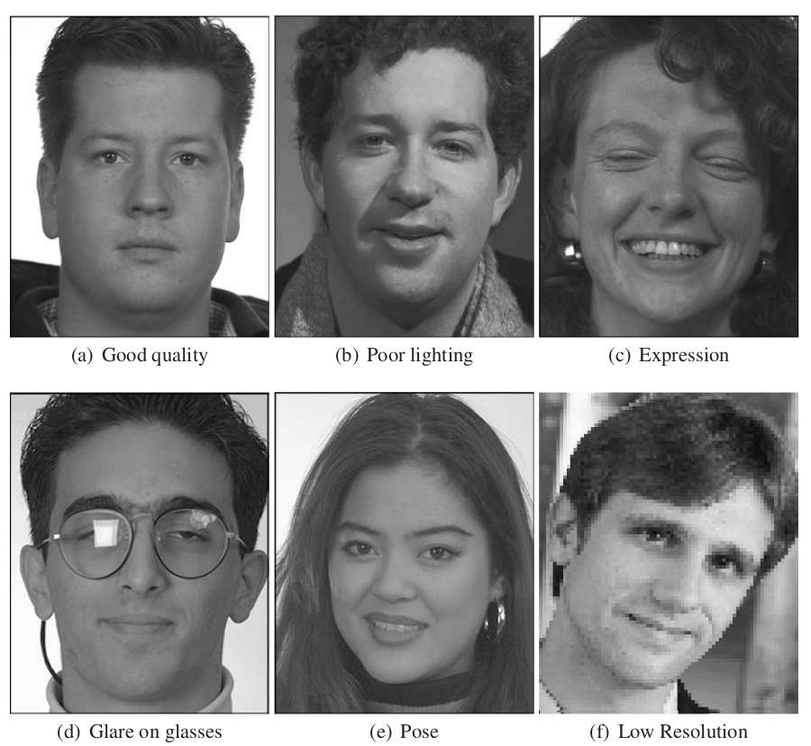

  

    Table of contents
  

  {: .text-delta }
- TOC
{:toc}

---

## Overview

The face image assessment module provides metrics including head pose, smile detection, inter-eye distance, closed eyes, etc.

Face image quality issues to investigate:

***

## Input

+ __BQAT-CLI__: Create a folder named `data` under your working directory and put your face images in this folder.

+ __BQAT-API / BQAT-Stateless__: Upload images via web API.

+ __BQAT-GUI__: Upload images via web page interface.

{: .highlight }
Supported file type: JPG, JPEG, JP2, BMP, PNG

***

<a name="alt-engine-output">
## Output

BQAT will produce quality metrics generated by processing engine selected in addition to input file metadata. The outputs will be stored as `CSV` via BQAT-CLI or `JSON` via BQAT-API.

Optional processing engines:

+ BQAT (default)
+ [OFIQ](https://pages.nist.gov/ifpc/2022/presentations/2_IFPC2022_OFIQ_Overview_Stratmann.pdf) (beta)
+ BIQT (beta)

***

__BQAT__:

| Column           | Description |
| ---------------- | ----------- |
| file             | Path to the input file |
| ipd              | Inter-pupillary distance |
| confidence       | Confidence level of face dectection (not quality score) |
| bbox_left        | Left border of the face bounding box coordinates in pixels |
| bbox_upper       | Upper border of the face bounding box coordinates in pixels |
| bbox_right       | Right border of the face bounding box coordinates in pixels |
| bbox_bottom      | Bottom border of the face bounding box coordinates in pixels |
| eye_closed_left  | Left eye close or not |
| eye_closed_right | Right eye close or not |
| pupil_right_x    | X coordinates of right pupil in pixels |
| pupil_right_y    | Y coordinates of right pupil in pixels |
| pupil_left_x     | X coordinates of left pupil in pixels |
| pupil_left_y     | Y coordinates of left pupil in pixels |
| yaw_pose         | Yaw in head pose direction |
| yaw_degree       | Yaw in head pose degree |
| pitch_pose       | Pitch in head pose direction |
| pitch_degree     | Pitch in head pose degree |
| roll_pose        | Roll in head pose direction |
| roll_degree      | Roll in head pose degree |
| smile            | Smile detected or not |
| glasses          | Glasses detected or not |
| image_width      | Width of the input image in pixels |
| image_height     | Height of the input image in pixels |

---

__OFIQ__:

{: .important }
OFIQ engine is still in early stage of development, might be unstable, use with care.

| Column           | Description |
| ---------------- | ----------- |
| file             | Filename of the input |
| quality          | [MagFace](https://github.com/IrvingMeng/MagFace)-based unified quality score measure |
| background_uniformity | Gradient-based background uniformity |
| illumination_uniformity | Illumination unformity by summing up the minima of the
histograms of the left and the right side of the face |
| luminance_mean | Luminance mean measure computed from the lumi-
nance histogram |
| luminance_variance | Luminance variance measure computed from the lumi-
nance histogram |
| under_exposure_prevention | Under-exposure prevention by computing the proportion
of low-intensity pixels in the luminance image to assess
the abscence of under-exposure |
| over_exposure_prevention | Over-exposure prevention by computing the proportion
of high-intensity pixels in the luminance image to assess
the abscence of over-exposure |
| dynamic_range | Dynamic range computed from the luminance histogram |
| sharpness | Sharpness assessment based on a random forest clas-
sifier trained by the OFIQ development team |
| compression_artifacts | Assessment of the absence of compression artifact (both
JPEG and JPEG2000) based on a CNN trained by the
OFIQ development team |
| natural_colour | Assessment of the naturalness of the colour based on
the conversion of the RGB presentation of the image to
the CIELAB colour space |
| single_face_present | Assessment of the uniqueness of the most dominant
face detected by comparing its size with the size of the
second largest face detected |
| eyes_open | Eyes openness assessment based on computing eyes
aspect ratio from eye landmarks |
| mouth_closed | Mouth closed assessment based on computing a ratio
from mouth landmarks |
| eyes_visible | Eyes visibility assessment by measuring the coverage of
the eye visibility zone with the result of face occlusion
segmentation computed during pre-processing |
| mouth_occlusion_prevention | Assessment of the absence of mouth occlusion by mea-
suring the coverage of the mouth region from mouth
landmarks with the result of face occlusion segmentation
computed on pre-processing |
| face_occlusion_prevention | Assessment of the absence of face occlusion by mea-
suring the coverage of the landmarked region with the
result of face occlusion segmentation computed during
pre-processing |
| inter_eye_distance | Inter-eye distance assessment based on computing the
Euclidean length of eyes' centres and multiplication with
the secant of the yaw angle computed during pre-
processing |
| head_size | Size of the head based on computing the height of the
face computed from facial landmarks with the height of
the image |
| leftward_crop_of_the_face_image | Left of the face image crop |
| rightward_crop_of_the_face_image | Right of the face image crop |
| downward_crop_of_the_face_image | Bottom of the face image crop |
| upward_crop_of_the_face_image | Top of the face image crop |
| head_pose_yaw | Pose angle yaw frontal alignment based on the [3DDFAV2](https://github.com/cleardusk/3DDFA_V2) |
| head_pose_pitch | Pose angle pitch frontal alignment based on the [3DDFAV2](https://github.com/cleardusk/3DDFA_V2) |
| head_pose_roll | Pose angle roll frontal alignment based on the [3DDFAV2](https://github.com/cleardusk/3DDFA_V2) |
| expression_neutrality | Expression neutrality estimation based on a fu-
sion of [HSEMotion](https://github.com/HSE-asavchenko/face-emotion-recognition) with [Efficient-Expression-Neutrality-Estimation](https://github.com/dasec/Efficient-Expression-Neutrality-Estimation) |
| no_head_coverings | Assessment of the absence of head coverings by count-
ing the pixels being labeled as head covers in the
mask output by the face parsing computed during pre-
processing |

{: .highlight }
> [OFIQ Project](https://www.bsi.bund.de/EN/Themen/Unternehmen-und-Organisationen/Informationen-und-Empfehlungen/Freie-Software/OFIQ/OFIQ_node.html)

---

__BIQT__:

| Column           | Description |
| ---------------- | ----------- |
| file             | Path to the input file |
| background_deviation | Image background deviation |
| background_grayness | Image background grayness |
| blur | Overall image blurriness |
| blur_face | Face area blurriness |
| focus | Overall image focus |
| focus_face | Face area focus |
| openbr_IPD | Inter eye distance from openbr |
| openbr_confidence | confidence value from openbr |
| opencv_IPD | Inter eye distance from opencv |
| opencv_eye_count | Eye count from opencv |
| opencv_face_found | Face count |
| opencv_face_height | Height of face detected |
| opencv_face_width | Width of face detected |
| opencv_frontal_face_found | Number of front facing head found |
| opencv_landmarks_count | Landmarks of face detected |
| opencv_mouth_count | Number of mouth detected |
| opencv_nose_count | Number of nose detected |
| opencv_profile_face_found | Number of side profile of head |
| over_exposure | Overall image exposure value |
| over_exposure_face | Face area exposure value |
| quality | Overall quality score |
| sap_code | Sap code |
| skin_ratio_face | Skin to face area ratio |
| skin_ratio_full | Skin to fill image area ratio |
| image_area | Image area |
| image_channels | Number of image colour channels |
| image_width | Width of the input image in pixels |
| image_height | Height of the input image in pixels |
| image_ratio | Image aspect ratio |
| openbr_left_eye_x | Left eye x coordinate in pixels |
| openbr_left_eye_y | Left eye y coordinate in pixels |
| openbr_left_eye_x | Right eye x coordinate in pixels |
| openbr_left_eye_x | Right eye y coordinate in pixels |
| opencv_face_center_of_mass_x | Face center of mass x coordinate in pixels |
| opencv_face_center_of_mass_y | Face center of mass y coordinate in pixels |
| opencv_face_offset_x | Face offset x coordinate in pixels |
| opencv_face_offset_y | Face offset y coordinate in pixels |
| opencv_face_x | Face x coordinate in pixels |
| opencv_face_y | Face y coordinate in pixels |
| opencv_left_eye_x | Left eye x coordinate in pixels |
| opencv_left_eye_y | Left eye y coordinate in pixels |
| opencv_right_eye_x | Right eye x coordinate in pixels |
| opencv_right_eye_y | Right eye y coordinate in pixels |
| opencv_mouth_x | Mouth x coordinate in pixels |
| opencv_mouth_y | Mouth y coordinate in pixels |
| opencv_nose_x | Nose x coordinate in pixels |
| opencv_nose_y | Nose y coordinate in pixels |

{: .note }
> Not all the columns are included in the table above for simplicity, for instance, there are normalized or scalar value of the same metrics.
