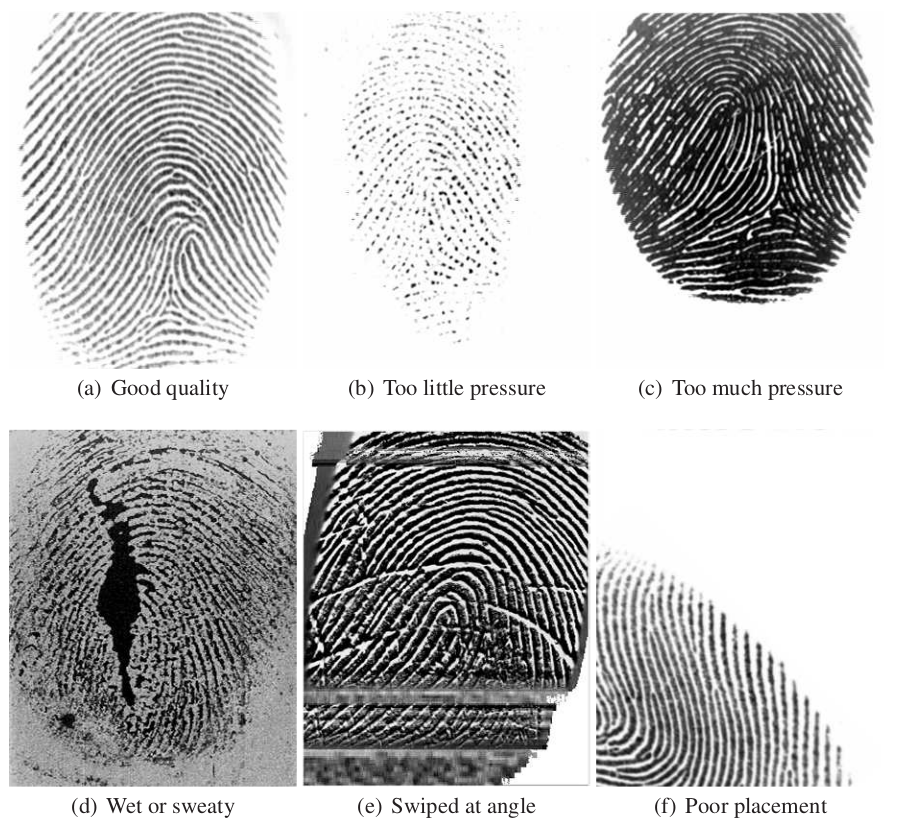

  

    Table of contents
  

  {: .text-delta }
- TOC
{:toc}

---

## Overview
The analysis of fingerprint engine based on NIST/NFIQ2 quality features. The quality score links image quality of optical and ink 500 PPI fingerprints to operational recognition performance.

## Examples of Fingerprint quality variation

***

## Input

For fingerprints the tool works with image formats WSQ and PNG. For both of these formats the image will be run directly through NFIQ2. Image formats excluding WSQ and PNG are first converted into a compatible format before being run through NFIQ2.

<!-- _Any biometric sample which was had preprocessing or conversion applied to it during the quality assessment process will be noted within the output log._ -->

NFIQ2 expects images to have a resolution of at least 500 PPI. The tool will force NFIQ2 to run on images of lower resolution but the result may be inaccurate.

***

## Output

The BQAT will produce the quality scores generated by the engines as well as additional info in columns. It will be saved as CSV from CLI or JSON from API.

***

__Fingerprint__:

| Column                          | Description|
|---------------------------------| -----------|
| file                            | Filename of the sample, including the directory path |
| QualityScore (NFIQ2)            | NFIQ2 quality score |
| Quantized                       | Input quantized or not |
| Resampled                       | Input resampled or not |
| UniformImage                    | Standard deviation of gray levels in image indicates uniformity ([NFIQ2](https://pages.nist.gov/NFIQ2/docs/v2.1.0/namespace_n_f_i_q2_1_1_identifiers_1_1_actionable_quality_feedback.html)) |
| EmptyImageOrContrastTooLow      | The image is blank or the contrast is too low ([NFIQ2](https://pages.nist.gov/NFIQ2/docs/v2.1.0/namespace_n_f_i_q2_1_1_identifiers_1_1_actionable_quality_feedback.html))
| FingerprintImageWithMinutiae    | Number of minutia in image ([NFIQ2](https://pages.nist.gov/NFIQ2/docs/v2.1.0/namespace_n_f_i_q2_1_1_identifiers_1_1_actionable_quality_feedback.html)) |
| SufficientFingerprintForeground | Number of pixels in the computed foreground ([NFIQ2](https://pages.nist.gov/NFIQ2/docs/v2.1.0/namespace_n_f_i_q2_1_1_identifiers_1_1_actionable_quality_feedback.html)) |
| EdgeStd                         | Metric to identify malformed images |
| Width                           | Width of the input in pixels |
| Height                          | Height of the input in pixels |
| tag                             | The unique id assigned to this image |
| log                             | Log info from backend if any |

> [NIST Interagency Report](https://nvlpubs.nist.gov/nistpubs/ir/2021/NIST.IR.8382.pdf)

