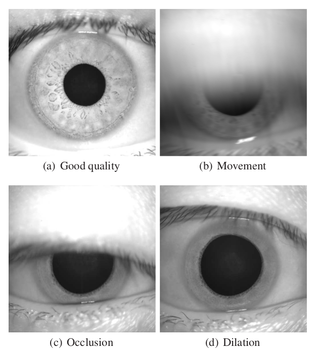

  

    Table of contents
  

  {: .text-delta }
- TOC
{:toc}

---

## Overview

The iris sample assessment module provides various quality attributes, features, and ISO metrics.

## Examples of Iris quality variation

***

## Input

Create a folder named `data` under your working directory, and put your iris images in this folder .

***

## Output

The BQAT will produce the quality scores generated by the engines as well as additional info in columns. It will be saved as CSV from CLI or JSON from API.

***

__Iris__:

| Column | Description |
| ------ | ----------- |
| quality | An overall quality score that leverages several statistics together |
| contrast | Raw score quantifying overall image contrast |
| sharpness | Raw score quantifying the sharpness of the image |
| iris_diameter | Raw diameter of the iris measured in pixels |
| percent_visible_iris | Percentage of visible iris area |
| iris_pupil_gs | Raw measure quantifying how distinguishable the boundary is between the pupil and the iris |
| iris_sclera_gs | Raw measure quantifying how distinguishable the boundary is between the iris and the sclera |
| iso_overall_quality | The overall ISO quality score based on the product of normalized individual iso metrics |
| iso_greyscale_utilization | The spread of intensity values regarding the pixel values within the iris portion of the image, recommended value: 6 or greater |
| iso_iris_pupil_concentricity | The degree to which the pupil centre and the iris centre are in the same location, recommended value: 90 or greater |
| iso_iris_pupil_contrast | The image characteristics at the boundary between the iris region and the pupil, recommended value: 30 or greater |
| iso_iris_pupil_ratio | The degree to which the pupil is dilated or constricted, recommended value: between 20 and 70 |
| iso_iris_sclera_contrast | The image characteristics at the boundary between the iris region and the sclera, recommended value: greater than 5 |
| iso_margin_adequacy | The degree to which the iris portion of the image is centred relative to the edges of the entire image, recommended value: greater than 80 |
| iso_pupil_boundary_circularity | The circularity of the iris-pupil boundary |
| iso_sharpness | The degree of focus present in the image |
| iso_usable_iris_area | The fraction of the iris portion of the image that is not occluded by eyelids, eyelashes, or specular reflections |
| width            | Width of the input in pixels |
| height           | Height of the input in pixels |
| tag              | The unique id assigned to this image |
| log              | Log info from backend if any |

> [Iris Engine](https://github.com/mitre/biqt-iris/blob/master/README.md)
