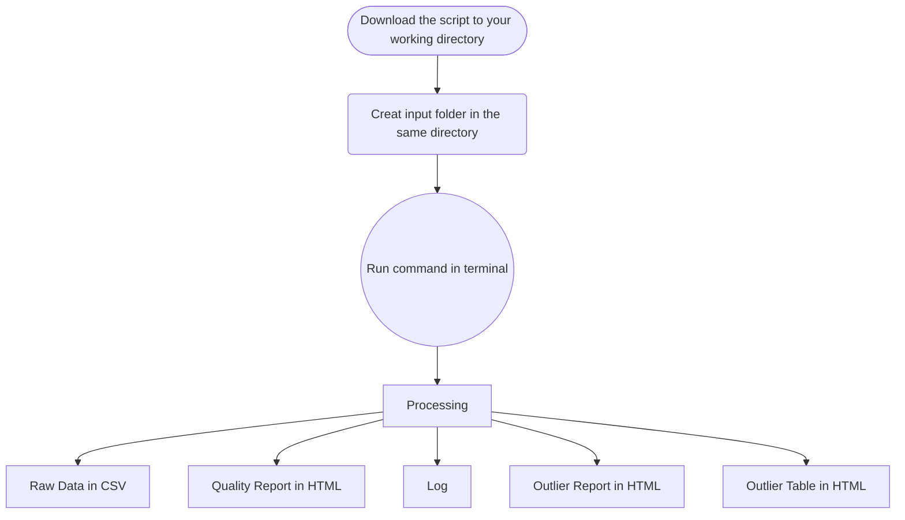

<details open markdown="block">
  <summary>
    Table of contents
  </summary>
  {: .text-delta }
- TOC
{:toc}
</details>

---

## Workflow




---

> Before executing the command, the working directory should look like this: 


---

> The script might need to be granted execute permission 

``` sh
chmod +x *.sh
```

## Use Cases

### Validate Installation or Benchmarking

If you want to validate your setup or benchmark your deployment machine: 

``` sh
./run.sh --benchmarking # you can specify mode (face, iris, finger) just like other command as well.
```

### Analyze Iris Images

If all the iris images are organised under the ‘data/input’ folder, the tool can be run in iris mode with the following command: 

``` sh
./run.sh --input data/input/ --mode iris
```

### Match Filename Pattern

Should the fingerprint files follow a naming convention containing the text ‘finger’, such as finger_1.jpg or X_finger.png, they can be located and analysed using: 

``` sh
./run.sh --input data/input/ --mode iris --filename "*FINGER*"
```

### Match Specific File Formats

If the input folder contains files in various formats and you want to focus on specific formats, the files can be identified and processed with this command: 

``` sh
./run.sh --input data/input/ --mode iris --search "jp2 pgm bmp"
```

### Pre-processing before Analyzing

Before initiating the fingerprint scanning process, the file format may need to be converted. Use the following command to convert files of `JP2` and `JPEG` to `PNG` (the default target format):

``` sh
./run.sh --input data/input/ --mode fingerprint --convert "jp2 jpeg"
```
If there is specific requirement for the file format, the following command can be used to specify the target format, for example, `WSQ`:

> All the pre-processing processes are temporary only for the following analysis task, it will not modify the input file, and won’t be kept after the analysis. 

``` sh
./run.sh --input data/input/ --mode fingerprint --target wsq
```

### Find Outliers using Filter

When a filter is applied, there is going to be 2 extra outputs, a quality report on the outliers filtered and a page for you to view these samples. 

Get output of finderprint samples with `NFIQ2` score larger than 60:

``` sh
./run.sh --input data/input/ --mode finger --query "NFIQ2>60"
```

Provide output CSV from previous run and apply filter: 

``` sh
./run.sh --mode filter --input data/output.csv --query "NFIQ2<40"
```

Keep only the specified columns (attributes) in the outlier outputs:

``` sh
./run.sh --mode filter --input data/output.csv --attributes NFIQ2 --query "NFIQ2<40"
```

### Select Alternative Face Analysis Engine

Currently, BQAT support 3 analysis engines for face modality:

+ BQAT by Biometix (default)
+ OFIQ from BSI
+ BIQT from MITRE

``` sh
./run.sh --mode face --input data/input/ --engine ofiq
```

### Miscellaneous

If you just want to get the raw CSV output, you may disable reporting feature:

``` sh
./run.sh --input data/input/ --mode iris --report false
```

Process samples in /input, but limit to first 100k files:

``` sh
./run.sh --input data/input/ --mode face --limit 100000
```

Generate EDA report directly from existing CSV:

``` sh
./run.sh --input data/results.csv --mode report
```

Update BQAT-CLI (pull the latest container):

``` sh
./run.sh --update
```

## Option Flags

Short | Long            | Description
----- | --------------- | -----------
`-M`  | `--mode`        | (REQUIRED)  Specify analysis mode (fingerprint, face, iris, speech, filter, report)
`-I`  | `--input`       | (REQUIRED)  Specify input directory
`-O`  | `--output`      | (OPTIONAL)  Specify output csv file or directory
`-R`  | `--report`      | (OPTIONAL)  Switch on/off EDA report generation (true, false)
`-E`  | `--engine`      | (OPTIONAL)  Select alternative face analysis engine (bqat, ofiq, biqt)
`-B`  | `--benchmark`   | (OPTIONAL)  Run system benchmarking analysis
`-L`  | `--limit`       | (OPTIONAL)  Set a limit for number of files to scan
`-F`  | `--filename`    | (OPTIONAL)  Specify filename pattern for searching in the folder
`-S`  | `--search`      | (OPTIONAL)  Specify file types to search within the input folder
`-C`  | `--convert`     | (OPTIONAL)  Specify file types to convert before processing
`-T`  | `--target`      | (OPTIONAL)  Specify target type to convert to
`-A`  | `--arm`         | (OPTIONAL)  Disable multithreading (For ARM64 platform)
`-D`  | `--attributes`  | (OPTIONAL)  Specify attributes (columns) to investigate
`-Q`  | `--query`       | (OPTIONAL)  Queries to apply on the attributes
`-W`  | `--cwd`         | (OPTIONAL)  Specify current working directory for url in the report


## Output Example

### Terminal Window


### Quality Report

#### Result Overview


#### Statistics of column `quality`


#### Cross Analysis 


### Filter for Outliers


### Tabulation of Outliers

You can click on it to view the origin file (need to be open in the working directory):


## Log

The log file will keep a record of information during the analysis process, including errors, warnings, and other metadata of the task. 

``` json
{
  "metadata": {
        "version": "BQAT v1.3.0 beta",
        "datetime": "2024-00-00 00:59:59.984337",
        "input directory": "data/finger/",
        "processed": 208,
        "failed": 0,
        "log": 17,
        "process time": "0h0m28s"
    },
  "log": [
    {
      "nfiq2": "Error: NFIQ2 computeQualityScore returned an error code: Could not create feature set from raw data: FRFXLL_ERR_FB_TOO_SMALL_AREA: Fingerprint area is too small. Most likely this is because the tip of the finger is presented.",
      "file": "data/finger/00001052_plain_500_10.png"
    },
    {
      "convert": "jp2 -> png",
      "file": "data/finger/solid_0_801x1000.jp2"
    },
    {
      "nfiq2": "Error: NFIQ2 computeQualityScore returned an error code: Width is too large after trimming whitespace. WxH: 801x1000, but maximum width is 800",
      "file": "data/finger/solid_0_801x1000.jp2"
    },
    {
      "convert": "jp2 -> png",
      "file": "data/finger/solid_0_800x1001.jp2"
    },
    {
      "nfiq2": "Error: NFIQ2 computeQualityScore returned an error code: Height is too large after trimming whitespace. WxH: 800x1001, but maximum height is 1000",
      "file": "data/finger/solid_0_800x1001.jp2"
    },
  ]
}
```

<!-- ## Benchmarking

The tool has a benchmark module to profile the host machine. It will go through a dataset of 1000 samples which consist of multiple formats and even corrupted files. The output also includes brief spec of the host machine. It can also be used to validate the installation/setup.

``` sh
# Start benchmarking
./run.sh --mode face --benchmarking
``` -->

<!-- ## Alternative interface

``` sh
# Enter interactive CLI
./run.sh --interactive

``` -->
<!-- TODO: output screenshot-->

<!-- ## Build the image locally

``` sh
# Clone the repo
git clone https://github.com/Biometix/bqat-cli.git

# Build the image
docker compose build
```

<!-- > Note: For powershell (windows) replace volumn mounted in the script as: `-v ${PWD}/data:/app/data` -->
