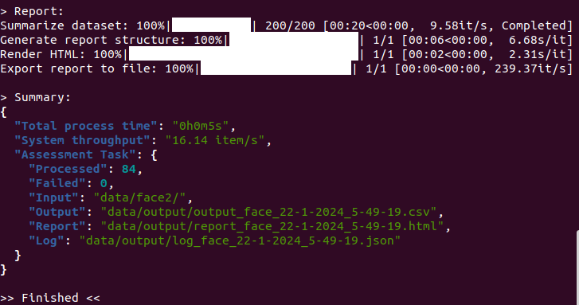
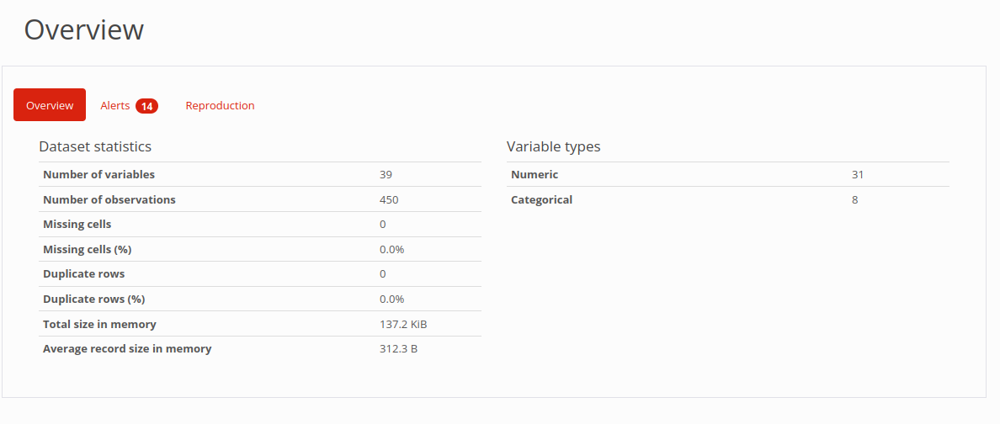
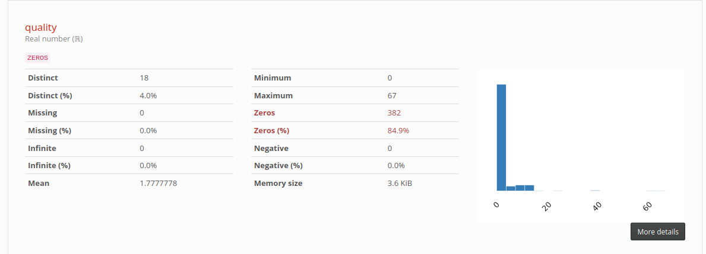
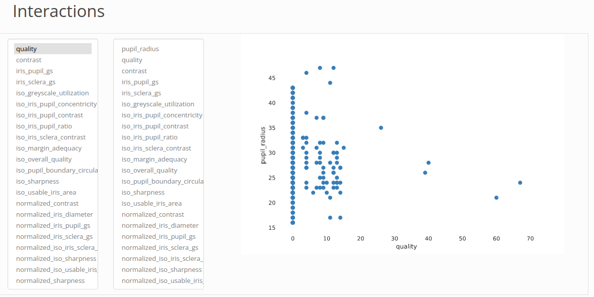
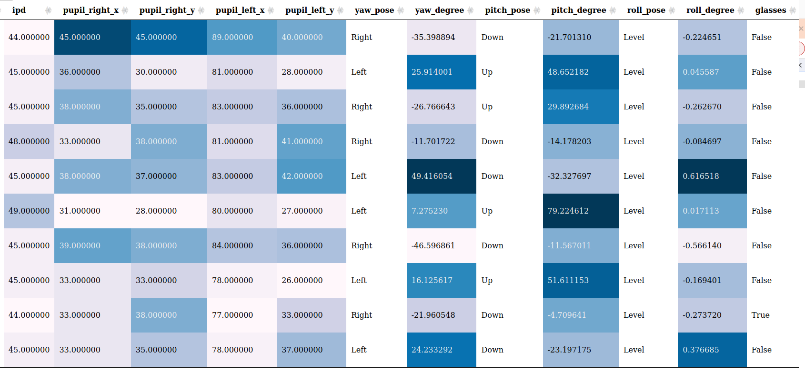

<details open markdown="block">
  <summary>
    Table of contents
  </summary>
  {: .text-delta }
- TOC
{:toc}
</details>

---

## Workflow


``` mermaid
---
config:
  theme: neutral
  layout: elk
---
graph TD
    download([Install BQAT CLI]) --> data(Creat input folder (/data) in your workspace)
    data --> run((Run command in terminal))
    run --> output[Processing]
    output --> csv[Raw Data in CSV]
    output --> quality[Quality Report in HTML]
    output --> log[Log]
    output --> outlier[Outlier Report in HTML]
    output --> table[Outlier Table in HTML]

```

---

> Before executing the command, the working directory should look like this: 


---

> If using pre-built binary, you need to grant execute permission to it. 

``` sh
chmod +x bqat
```

> And replace the command `bqat` with `./bqat`:

``` sh
./bqat --version
```

## Use Cases

### Validate Installation or Benchmarking

To validate your setup or benchmark your machine: 

``` sh
bqat --benchmarking # you can specify modality (face, iris, finger) just like regular run too.
```

``` sh
bqat -B -M fingerprint # benchmark fingerprint analysis.
```

``` sh
bqat -B -M face -E ofiq # benchmark face analysis with OFIQ engine.
```

### Analyze Iris Images

If all the iris images are organised under the ‘data/input’ folder, the tool can be run in iris mode with the following command: 

``` sh
bqat --input data/input/ --mode iris
```

### Match Filename Pattern

Should the fingerprint files follow a naming convention containing the text ‘finger’, such as finger_1.jpg or X_finger.png, they can be located and analysed using: 

``` sh
bqat --input data/input/ --mode iris --filename "*FINGER*"
```

### Match Specific File Formats

If the input folder contains files in various formats and you want to focus on specific formats, the files can be identified and processed with this command: 

``` sh
bqat --input data/input/ --mode iris --type "jp2,bmp"
```

### Pre-processing before Analyzing

Before initiating the fingerprint scanning process, the file format may need to be converted. Use the following command to convert files of `JP2` and `JPEG` to `PNG` (the default target format):

``` sh
bqat --input data/input/ --mode fingerprint --convert "jp2,jpeg"
```
If there is specific requirement for the file format, the following command can be used to specify the target format, for example, `WSQ`:

> All the pre-processing processes are temporary only for the following analysis task, it will not modify the input file, and won’t be kept after the analysis. 

``` sh
bqat --input data/input/ --mode fingerprint --target wsq
```

### Find Outliers using Filter

When a filter is applied, there is going to be 2 extra outputs, a quality report on the outliers filtered and a page for you to view these samples. 

Get output of finderprint samples with `NFIQ2` score larger than 60:

``` sh
bqat --input data/input/ --mode finger --query "NFIQ2>60"
```

Provide output CSV from previous run and apply filter: 

``` sh
bqat --mode filter --input data/output.csv --query "NFIQ2<40"
```

Selected columns and apply filter query to them:

``` sh
bqat --mode filter --input data/output.csv --columns "NFIQ2,edge_std" --query "NFIQ2<40"
```

> Note: If there is any space along the filepath, wrap it with double quotes and escape the space.<br> Please refer to the example below: 

e.g. input folder is `data/iris folder/`

```sh
bqat --input "data/iris\ folder/" --mode iris
```

<a name="alt-engine">
### Select Alternative Face Analysis [Engines](https://biometix.github.io/modality/face.html#alt-engine-output)

Currently, BQAT support 3 analysis engines for face modality:

+ BQAT (default engine created by Biometix)
+ OFIQ (from BSI)
+ BIQT (from MITRE)

``` sh
bqat --mode face --input data/input/ --engine ofiq
```

### Fusion Engine Mode

Specify `fusion` as the engine will give you combined output from both BQAT and OFIQ:

``` sh
bqat --mode face --input data/input/ --engine fusion
```

You may combine more than one engine using code below:

| Engine | Code |
| --- | --- |
| BQAT | 4 (100) |
| OFIQ | 2 (010) |
| BIQT | 1 (001) |

BQAT and BIQT:

``` sh
bqat --mode face --input data/input/ --engine fusion --fusion 5
```

All 3 engines:

``` sh
bqat --mode face --input data/input/ --engine fusion --fusion 7
```

### Preprocessing Mode

You can feed a dataset to BQAT and preprocess the images for later analysis.

The following example shows how you can send the folder `data/input/` in, and:
+ Convert the images to PNG format
+ Convert color mode to RGB
+ Resize the images by percentage (30% in this case)

``` sh
bqat -M preprocess -I data/input/ --config png,0.3,rgb
```

And of course you could configured it to do single preprocess at a time.

``` sh
# convert images to BMP
bqat -M preprocess -I data/input/ --config bmp

# convert images to grayscale
bqat -M preprocess -I data/input/ --config grayscale

# resize images by width (300px in this case, height will be inferred accordingly, aspect ratio maintained)
bqat -M preprocess -I data/input/ --config 300
```

> In terms of resizing configuration, number smaller than 10 will be treated as percentage/magnification, for instance, 3.7 will be 370%, while 128, which is greater than 10, will be 128 in width.

### Miscellaneous

Enable reporting to get a EDA report and preview page along with the raw CSV output:

``` sh
bqat --input data/input/ --mode iris --reporting
```

Process samples in /input, but limit to first 100k files:

``` sh
bqat --input data/input/ --mode face --limit 100000
```

Generate EDA report directly from existing CSV:

``` sh
bqat --input data/results.csv --mode report
```

## Option Flags

Short | Long            | Description
----- | --------------- | -----------
`-M`  | `--mode`        | (REQUIRED)  Specify BQAT running mode (fingerprint, face, iris, speech, filter, report, preprocessing).
`-I`  | `--input`       | (REQUIRED)  Specify input directory or CSV file for analysis.
`-O`  | `--output`      | (OPTIONAL)  Specify output directory.
`-R`  | `--reporting`   | (OPTIONAL)  Switch on/off EDA report generation (true, false).
`-E`  | `--engine`      | (OPTIONAL)  Select alternative face analysis engine (bqat, ofiq, biqt, fusion).
NA    | `--fusion`      | (OPTIONAL)  Fusion mode engine code.
`-B`  | `--benchmarking`| (OPTIONAL)  Run system benchmarking analysis.
`-L`  | `--limit`       | (OPTIONAL)  Set a limit for number of files to process.
`-F`  | `--filename`    | (OPTIONAL)  Specify filename pattern for searching in the folder.
NA    | `--type`        | (OPTIONAL)  Specify file types to process in the input folder.
`-C`  | `--convert`     | (OPTIONAL)  Specify file types to convert before processing.
`-T`  | `--target`      | (OPTIONAL)  Specify target type to convert to.
`-A`  | `--arm`         | (OPTIONAL)  Disable multithreading (For ARM64 platform)
NA    | `--columns`     | (OPTIONAL)  Select columns to investigate
`-Q`  | `--query`       | (OPTIONAL)  Queries to apply on the columns
`-W`  | `--cwd`         | (OPTIONAL)  Specify current working directory for url in the report
NA    | `--config`      | (OPTIONAL)  Configure preprocessing task ([target format],[target width],[color mode (grayscale, rgb)]").

## Advanced

Check verions:

``` sh
bqat --version
```

Update BQAT-CLI (pull the latest container):

``` sh
bqat --update
```

Uninstall BQAT-CLI (CLI tool and/or backend container):

```sh
bqat --uninstall
```

Specify alternative backend container:

```sh
bqat --tag ghcr.io/biometix/bqat-cli:v2.0.0
```

## Output Example

### Terminal Window



### Quality Report

#### Result Overview



#### Statistics of column `quality`



#### Cross Analysis 



### Filter for Outliers


### Tabulation of Outliers

You can click on it to view the origin file (need to be open in the working directory):



## Log

The log file will keep a record of information during the analysis process, including errors, warnings, and other metadata of the task. 

``` json
{
  "metadata": {
        "version": "BQAT v1.3.0 beta",
        "datetime": "2024-00-00 00:59:59.984337",
        "input directory": "data/finger/",
        "processed": 208,
        "failed": 0,
        "log": 17,
        "process time": "0h0m28s"
    },
  "log": [
    {
      "nfiq2": "Error: NFIQ2 computeQualityScore returned an error code: Could not create feature set from raw data: FRFXLL_ERR_FB_TOO_SMALL_AREA: Fingerprint area is too small. Most likely this is because the tip of the finger is presented.",
      "file": "data/finger/00001052_plain_500_10.png"
    },
    {
      "convert": "jp2 -> png",
      "file": "data/finger/solid_0_801x1000.jp2"
    },
    {
      "nfiq2": "Error: NFIQ2 computeQualityScore returned an error code: Width is too large after trimming whitespace. WxH: 801x1000, but maximum width is 800",
      "file": "data/finger/solid_0_801x1000.jp2"
    },
    {
      "convert": "jp2 -> png",
      "file": "data/finger/solid_0_800x1001.jp2"
    },
    {
      "nfiq2": "Error: NFIQ2 computeQualityScore returned an error code: Height is too large after trimming whitespace. WxH: 800x1001, but maximum height is 1000",
      "file": "data/finger/solid_0_800x1001.jp2"
    },
  ]
}
```

<!-- ## Benchmarking

The tool has a benchmark module to profile the host machine. It will go through a dataset of 1000 samples which consist of multiple formats and even corrupted files. The output also includes brief spec of the host machine. It can also be used to validate the installation/setup.

``` sh
# Start benchmarking
./run.sh --mode face --benchmarking
``` -->

<!-- ## Alternative interface

``` sh
# Enter interactive CLI
./run.sh --interactive

``` -->
<!-- TODO: output screenshot-->

<!-- ## Build the image locally

``` sh
# Clone the repo
git clone https://github.com/Biometix/bqat-cli.git

# Build the image
docker compose build
```

<!-- > Note: For powershell (windows) replace volumn mounted in the script as: `-v ${PWD}/data:/app/data` -->
