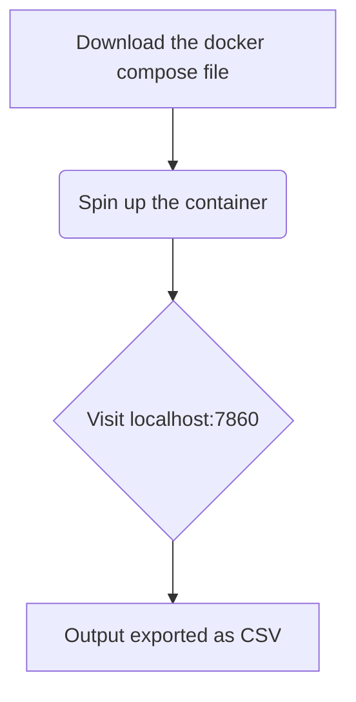
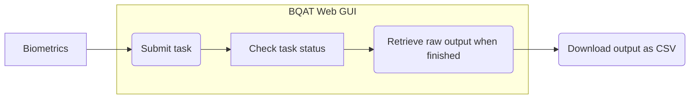
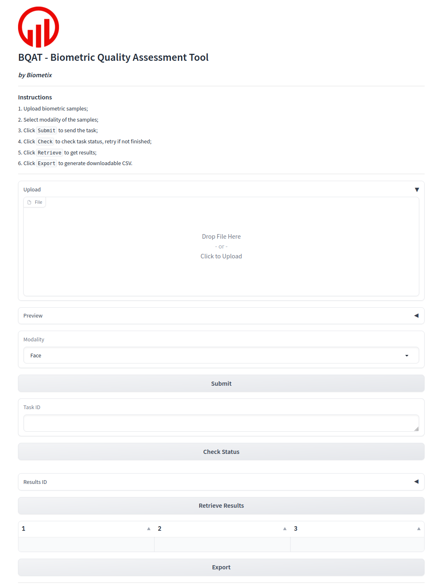

  

    Table of contents
  

  {: .text-delta }
- TOC
{:toc}

---

## Setting Up

``` mermaid

graph TD
    download[Download the docker compose file] --> run(Spin up the container)
    run --> web{Visit localhost:7860}
    web --> output[Output exported as CSV]

```

---

## Workflow

``` mermaid

graph LR
    input[Biometrics] --> submit(Submit task)
    subgraph BQAT Web GUI
    submit --> check[Check task status]
    check --> retrieve(Retrieve raw output when finished)
    end
    retrieve --> export(Download output as CSV)

```

## Web GUI

---

## Output

The output can be downloaded as CSV.

