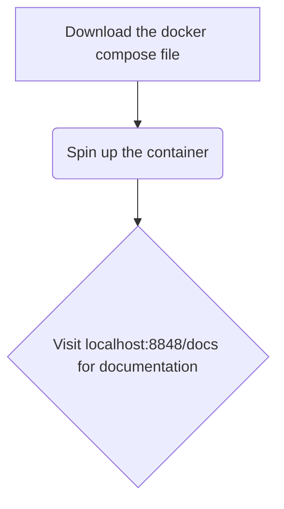
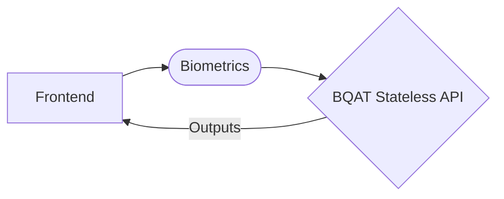
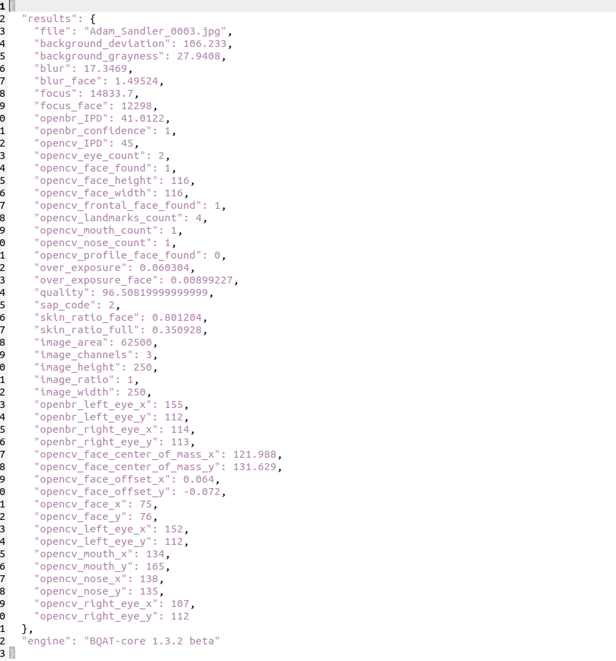

<details open markdown="block">
  <summary>
    Table of contents
  </summary>
  {: .text-delta }
- TOC
{:toc}
</details>

---
## Set up



## Workflow



## Endpoints

---

### POST /file

Upload a biometric file for quality assessment:

- **file**: biometric file
- **modality**: specify modality of the biometric

---

### POST /base64

Upload a biometric file (base64) for quality assessment:

- **modality**: specify modality of the biometric.
- **type**: biometric file type (png, jpg, wav, jp2, etc.).
- **data**: biometric file encoded as base64 string.
- **id**: biometric file identifier.
- **timestamp**: ISO 8601 date and time format.

---

> Note: Refer to `localhost:8848/docs` for full list of endpoints.

<!-- 

## Response

 -->

## Response

JSON:

``` JSON
{
  "file": "12347.jpg",
  "image_height": 244,
  "image_width": 212,
  "confidence": 0.866117537021637,
  "bbox_left": 49,
  "bbox_upper": 74,
  "bbox_right": 183,
  "bbox_lower": 208,
  "smile": false,
  "eye_closed_left": false,
  "eye_closed_right": false,
  "ipd": 48,
  "pupil_right_x": 43,
  "pupil_right_y": 45,
  "pupil_left_x": 91,
  "pupil_left_y": 47,
  "yaw_pose": "Right",
  "yaw_degree": -24.930552093832574,
  "pitch_pose": "Down",
  "pitch_degree": -32.260817406476285,
  "roll_pose": "Level",
  "roll_degree": -0.4556886155332786,
  "glasses": true
}
```