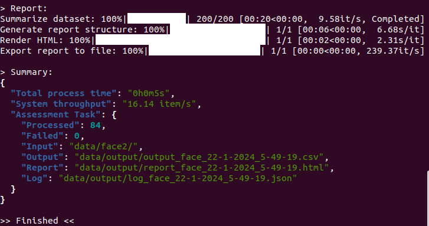
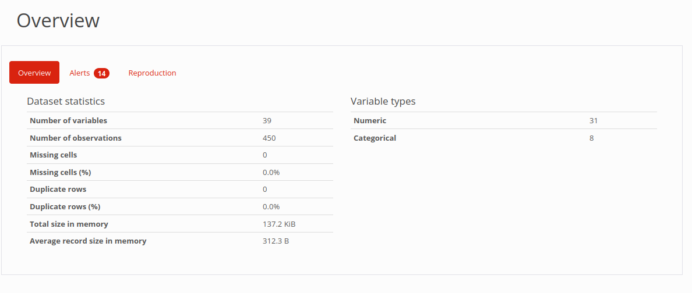
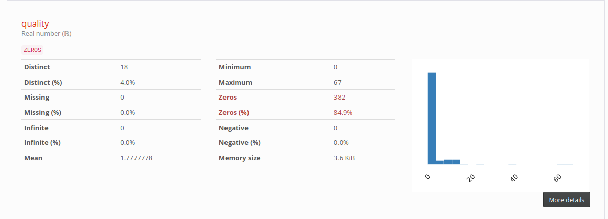
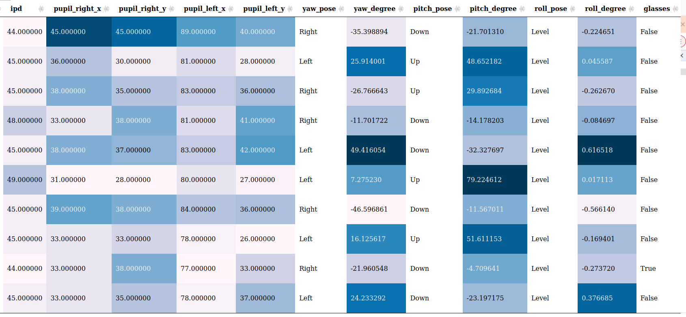

<details open markdown="block">
  <summary>
    Table of contents
  </summary>
  {: .text-delta }
- TOC
{:toc}
</details>

---

## Workflow

---
BQAT CLI


<!-- TODO: workflow diagram-->

## Use Cases

``` sh
# Scenario 1: Analyzing Iris Images
# If all your iris images are neatly organized under the 'data/input' folder,
# you can run the script in iris mode with the following command:
./run.sh --input data/input/ --mode iris

# Scenario 2: Searching and Analyzing Fingerprint Images
# Suppose your fingerprint files follow a naming convention containing the text 'finger',
# such as finger_1.jpg or X_finger.png, you can seamlessly locate and analyze them using:
./run.sh --input data/input/ --mode iris --filename "*FINGER*"

# Scenario 3: Searching for Specific File Formats
# If your input folder contains various image files and you want to focus on specific formats,
# you can effortlessly identifies and processes the files with this command:
./run.sh --input data/input/ --mode iris --search "jp2 pgm bmp"

# Scenario 4: Pre-processing Files Before Fingerprint Scanning
# Before initiating the fingerprint scanning process, you may need to convert certain files to target format like png.
# Use the following command to convert files with formats like jp2 and jpeg before scanning:
./run.sh --input data/input/ --mode fingerprint --convert "jp2 jpeg"

# Scenario 5: Specifying the Target File Format for Conversion
# If you have specific requirements for the output file format after conversion during fingerprint scanning,
# you can use the following command to specify the target format, for example, wsq:
./run.sh --input data/input/ --mode fingerprint --target wsq

# Run samples in /input with face mode, limit to 100k scan
./run.sh --input data/input/ --mode face --limit 100000

# Run with the output filtered by specified query
./run.sh --input data/input/ --mode finger --attributes NFIQ2 --query "NFIQ2>20"

# Filter existing output CSV file with specified query
./run.sh --mode filter --output data/output.csv --query "NFIQ2>20"

# Filter existing output CSV file with query on specified attributes (columns)
./run.sh --mode filter --output data/output.csv --attributes NFIQ2 --query "NFIQ2>20"
```

## Option Flags

Short | Long            | Description
----- | --------------- | -----------
`-M`  | `--mode`        | (REQUIRED)  Specify analysis mode (fingerprint, face, iris, speech, filter)
`-I`  | `--input`       | (REQUIRED)  Specify input directory
`-O`  | `--output`      | (OPTIONAL)  Specify output csv file or directory
`-B`  | `--benchmark`   | (OPTIONAL)  Run system benchmarking analysis
`-L`  | `--limit`       | (OPTIONAL)  Set a limit for number of files to scan
`-F`  | `--filename`    | (OPTIONAL)  Specify filename pattern for searching in the folder
`-S`  | `--search`      | (OPTIONAL)  Specify file types to search within the input folder
`-C`  | `--convert`     | (OPTIONAL)  Specify file types to convert before processing
`-T`  | `--target`      | (OPTIONAL)  Specify target type to convert to
`-A`  | `--arm`         | (OPTIONAL)  Disable multithreading (For ARM64 platform)
`-X`  | `--interactive` | (OPTIONAL)  Enter terminal interactive UI
`-D`  | `--attributes`  | (OPTIONAL)  Specify attributes (columns) to investigate
`-Q`  | `--query`       | (OPTIONAL)  Queries to apply on the attributes
`-R`  | `--sort`  | (OPTIONAL)  Specify attributes (columns) to sort by
`-W`  | `--cwd`  | (OPTIONAL)  Specify current working directory for url in the report


## Output

Ouput Sample:





Outlier detect Sample:



## Log

The log file will keep record of information on the analysis process, including errors, warnings, and other metadata of the job.

## Benchmarking

The tool has a benchmark module to profile the host machine. It will go through a dataset of 1000 samples which consist of multiple formats and even corrupted files. The output also includes brief spec of the host machine. It can also be used to validate the setup.

``` sh
# Start benchmarking
./run.sh --mode face --benchmarking
```

## Alternative interface

``` sh
# Enter interactive CLI
./run.sh --interactive

```
<!-- TODO: output screenshot-->

<!-- ## Build the image locally

``` sh
# Clone the repo
git clone https://github.com/Biometix/bqat-cli.git

# Build the image
docker compose build
```

> Note: For powershell (windows) replace volumn mounted in the script as: `-v ${PWD}/data:/app/data` -->
