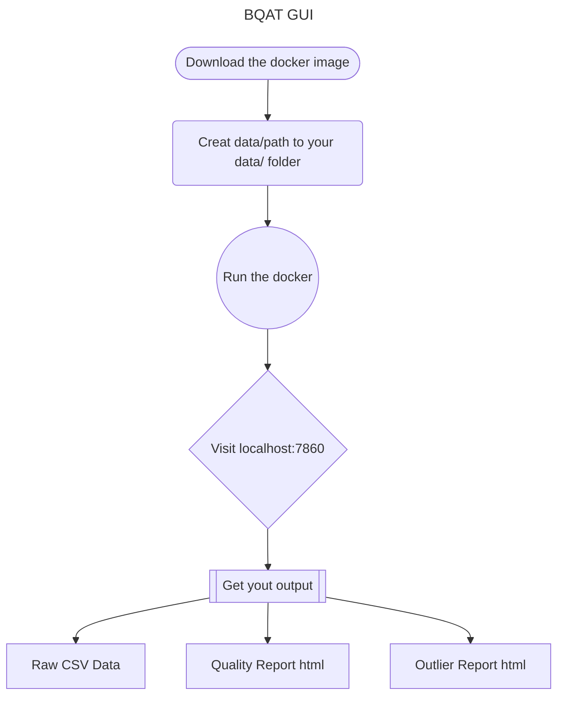

  

    Table of contents
  

  {: .text-delta }
- TOC
{:toc}

---

## Workflow

``` mermaid

---
title: BQAT GUI
---

graph TD
    download([Download the docker image]) --> data(Creat data/path to your data/ folder)
    data(Creat data/path to your data/ folder) --> run((Run the docker))
    run((Run the docker)) --> web{Visit localhost:7860}
    web{Visit localhost:7860} --> output[[Get yout output]]
    output[[Get yout output]] --> csv[Raw CSV Data]
    output[[Get yout output]] --> report[Quality Report html]
    output[[Get yout output]] --> outlier[Outlier Report html]

```

## Web GUI

## Output

<!-- TODO: report screenshots-->
